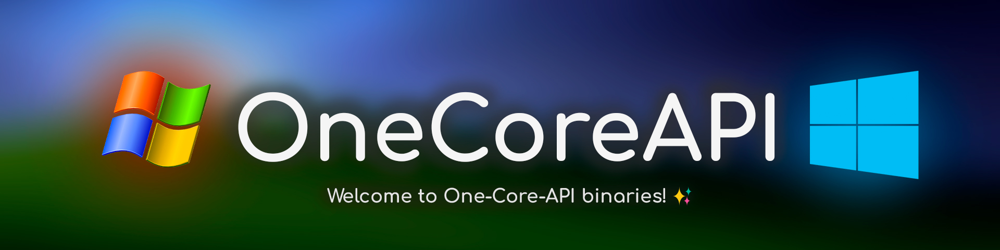

  
  <h6>特别感谢 @pashtetusss777 设计的横幅</h6>

***
**语言:**    
[English](README.md) | [简体中文](README_CN.md) | [繁體中文](README_CHT.md) | [Русский](README_RU.md) | [Українська](README_UK.md) | [日本語](README_JP.md) | [Português-Brasil](README_BR.md)

  
关于中文自述（README_CN.md）

- **最初的旧版中文自述由 [Coconutat](https://github.com/Coconutat) 贡献。**
- **[結束バンドbocchi](https://github.com/jonm58) 维护了旧版中文自述，现在不定期维护新版中文自述**
- **新版中文自述由 [Mike Wang](https://github.com/Diamochang) 贡献。由于翻译底稿系深度求索 [DeepSeek R1 671B](https://github.com/deepseek-ai/DeepSeek-R1) 生成，尽管经过人工校对和修改，但难免有遗漏或错误。如有建议，可以在创建相关 Issue 或 PR 时在描述中 @ 他。**

**本仓库包含 One-Core-API 项目的二进制发行版，兼容 Windows Server 2003 RTM/SP1/SP2、Windows XP RTM/SP1/SP2/SP3 及 Windows XP x64 SP1/SP2。强烈建议使用最新 SP（服务包）和所有可用更新的系统。** **警告！**
  现在，OCA 默认使用 Directx Native 软件渲染。要运行 dx10+ 游戏，您必须复制以下文件  <Your installation letter >\Windows\System32\wined3d 进入游戏安装目录。否则，游戏将无法启动或黑屏！

**One-Core-API 是什么？**

众所周知，Windows XP在2014年就失去了微软的官方支持。其中有个特殊版本Posready 2009的支持也于2019年终止——这已是六年前的事。因此，在2012至2016年间，各大厂商陆续停止开发Windows XP驱动程序，NVIDIA也成为最后一家为XP提供支持的主流硬件厂商。与此同时，软件开发者们也在同期逐步终止对XP的兼容支持。所以，不论您是出于怀旧情结、认为XP优于新版系统，或是其他任何原因，若想在现代硬件和软件环境中使用Windows XP，几乎是不可能实现的——除少数特例之外。具体而言，目前仅有MyPal 68/78浏览器以及Supermium（一款能从XP兼容到Windows 10的Chromium修改版）可供使用。除此之外，几乎再无现代软件能与XP兼容。正因如此，我们开发了One-Core-API来解决这一问题：旨在重建Windows XP和Server 2003的软硬件兼容性。

但存在一个核心难题：XP与Windows Vista之间存在巨大的技术代差，Vista中引入的新技术约有90%至95%都未在XP系统中实现（除少数由微软移植的功能外）。这极大增加了兼容工作的难度，并可能导致大量错误。因此，One-Core-API可能存在稳定性问题，甚至损坏某些系统。测试环境也存在局限性——由于可能出现的无数种的故障场景以及人手不足（我作为主要开发者，仅有Murak、Svyatpro以及新加入的CoccodrillooXDS等少数成员的协助），我们无法预判所有问题。

请您理解：One-Core-API是目前唯一能运行大量现代应用程序（包括游戏）的项目，但它仍处于高强度开发阶段，错误在所难免。我们需要您的耐心：如果您遇到问题，请在此反馈而非抱怨。若您心怀热忱，请助力Windows XP社区的发展。衷心感谢！

> [!WARNING]
> OCA 默认使用原生 DirectX 软件渲染.
>
> 要运行 dx10+ 游戏，您必须复制以下文件  <Your installation letter >\Windows\System32\wined3d 进入游戏安装目录。
> 否则，游戏将无法启动或黑屏！

<!-- **官方 Discord 服务器**: <h2>https://discord.gg/eRcGuFtn6p</h2> -->

- [核心功能](#核心功能)
  - [使用前须知](#使用前须知)
- [如何安装 One-Core-API？](#如何安装-one-core-api)
- [如何卸载 One-Core-API？](#如何卸载-one-core-api)
- [应用程序兼容性](#应用程序兼容性)
- [已知限制](#已知限制)
- [提交问题前...](#提交问题前)
- [仓库结构](#仓库结构)
- [扩展信息与链接](#扩展信息与链接)
  - [官方 Discord 服务器](#官方-discord-服务器)
- [效果展示和概念验证](#效果展示和概念验证)

## 核心功能
- **支持通过设置兼容性模式运行为现代 Windows 系统设计的新程序**
- **支持新硬件和新硬盘控制器的现代驱动**
- **全面支持 Windows XP 和 Windows Server 2003 的所有语言版本**

### 使用前须知

> 该软件使用了各系统的修改文件，还包括仍处于测试或实验阶段的文件，<b>由一人开发</b>。因此，预测各种计算机配置或虚拟机中可能出现的所有情况是不可行的。
>
> <h4>Windows XP/2003 和 Vista 之间的过渡标志着新 API、技术开发和现有 API 修改方面的重大飞跃。这使得在 NT 5.x 和 NT 6.x 系统之间实现同等程度的兼容性具有挑战性。</h4>
>
> 我恳请您保持冷静和谨慎。
> 在得出软件有缺陷或 "质量差 "的结论之前，<b>请通过 Github Issues 或 [Discord 服务器](https://discord.gg/eRcGuFtn6p)</b>报告您遇到的任何问题。
>
> 请注意，我不能保证所有问题都能得到解决。但是，我会分析这些问题，并尽一切努力予以纠正。
>
> 您的帮助是宝贵的，投诉或负面反馈无助于产品的改进。
>
> 为了防止 BSOD，x86 软件包现在分为三种类型：x86（标准）、x86 AVX（使用来自 Mox Ax 的 AVX 补丁）和 x86 PAE。最稳定的是 x86 标准。AVX 补丁为应用程序提供 AVX 支持，防止新安装程序崩溃（仅适用于 XP x86 SP3）。PAE 版本提供 128GB RAM 支持，但会导致多次 BSOD。请谨慎使用，风险自负；

## 如何安装 One-Core-API？

One-Core-API 采用 Windows NT 5.x 及更早系统的补丁安装技术，其安装过程与服务包更新类似。请前往 [发行版](https://github.com/Shorthorn-project/One-Core-API-Binaries/releases) 页面选择版本并下载压缩包（`.zip`）。下载完成后，解压文件，你会看到有四个压缩文件，分别是 x86、x86（含 AVX 补丁）、x86（含 PAE 支持）和 x64。每个文件夹中都有一个可执行文件，名为 One-Core-API-Pack.exe。双击运行并按向导指引操作即可（下一步 -> 接受协议 -> 完成）。

  
图解

1. **下载示例：**

2. **解压文件：**

3. **选择架构（无 x64 标识则为 x86）：**

4. **双击安装程序：**

5. **进入向导：**

6. **接受协议并继续：**

7. **等待安装完成：**

8. **完成安装并重启：**

## 如何卸载 One-Core-API？

如前所述，One-Core-API 使用的是 Windows NT 系列 5.x 以下版本的热修复安装技术。因此，要卸载它，必须进入**控制面板 -> 添加/删除程序**，然后勾选 **“显示更新”** 选项。选择该选项后，将显示多个更新（如果已安装），其中包括 One-Core-API。向下滚动窗口，直到显示 One-Core-API，然后点击它。这时会出现一个 **“删除”** 按钮。点击该按钮，然后按照卸载步骤进行操作（基本上是 “下一步”->“完成”）。

  
图解

1. **打开控制面板：**

2. **进入“添加或删除程序”：**

3. **勾选显示更新：**

4. **定位 One-Core-API 条目：**

5. **点击删除按钮：**

6. **进入卸载向导：**

7. **等待卸载完成：**

8. **完成卸载并重启：**

## 应用程序兼容性

  
浏览器和电子邮件客户端

  
  - 最新版本的 Chromium 浏览器（Chrome、Opera、Edge 和其他浏览器)
  - 版本 109 的 Chrome 安装程序（暂不支持 Windows 10 版本）
  - 基于 Gecko 的浏览器（Firefox、Zen 浏览器），最高支持到最新版本（不过，YouTube 只能支持到 Firefox 130 版本）；
  - Seamonkey 2.53.10 以下版本；
  - 傲游浏览器 7.1.6 以下版本；
  - Vivaldi 最新版本；
  - Epic 浏览器 120
  - 雷鸟（Thunderbird）最新版本

  
信使和其他通讯程序

  - Discord 0.309.0;
  - Legocord (Discord 分支) 最新版本;
  - Telegram Desktop;
  - Line;
  - Zoom;
  - Filezilla (最新版本);
  - TeamViewer 14

 

  
办公软件

  - LibreOffice 24.0.x (最新版本);
  - Adobe Reader DC （至 2024 版）
  - 福昕 PDF 阅读器 (最新版本)

  
IDE (集成开发环境) 和编程语言

  - JetBrains IDE 最新版本（2024）；
  - Visual Studio 2012 和 Visual Studio 2013；
  - 最新版本的 Eclipse IDE；
  - 最新版本的 Visual Studio Code（以及 Codium 等分叉）；
  - 最新版本的 Android Studio；
  - NetBeans 最新版本；
  - Python 3.6（3.8/3.9 也可使用，但仅限 [mod](https://mega.nz/folder/KxExlAiC#L9rAQ5kTCtlHgZUwaxMpgw) 版本）

  
Java

  - Java JDK 和替代 JDK 或 OpenJDK，最高版本为 24（其他版本可能也适用）。您可以从 https://bell-sw.com/pages/downloads/#/java-11-lts 下载；
  - JDK 1.8（目前仅限 Windows XP x64）

  
来自 Windows Vista/7 的原生应用程序

- Windows 7 原生游戏
- Windows 7 画图
- Windows 7 写字板
- Windows Vista 原生应用

  
OpenGL、Directx 9EX、10、11 的游戏

### WARNING!
> OCA 默认使用原生 DirectX 软件渲染.
>
> 要运行 dx10+ 游戏，您必须复制以下文件  <Your installation letter >\Windows\System32\wined3d 进入游戏安装目录。
> 否则，游戏将无法启动或黑屏！

  - 极品飞车：最高通缉 2012
  - 极品飞车：亡命狂飙
  - 街头霸王 V
  - 不义联盟：人间之神
  - 刺客信条：黑旗
  - 孤岛危机 1 / 2 / 3（DX10 - 11 模式）
  - GTA 三部曲最终版
  - GTA V
  - 我的世界 1.21.x
  - 生化危机 5（DX10 模式）
  - 失落的星球
  - 孤岛惊魂 4
  - 孤岛惊魂：原始杀戮
  - 海岛大亨 5
  - 地铁：最后的曙光
  - 茶杯头
  - 追逐地平线Turbo（原文：Horizon Turbo）

  
其他

  - Adobe 产品（Photoshop、Illustrator、Dreamweaver 等），最高到 2019 版本;
  - .NET Framework 至 4.8 版;
  - .NET 6.0
  - Geekbench 4.2;
  - Performance Test;
  - 适用于 Windows 7 和 Windows 10 的 Spotify;
  - Node 10.24;
  - WinRAR 7.0（最新版）;
  - Postman;
  - Dbeaver;
  - Kate 23.08.1
  - AIMP
  - Foobar2000

## 已知限制
- Firefox 131 及以上版本无法播放 YouTube，推荐使用 115 或 128 ESR 版
- 部分安装程序可能失效（如某些 Electron 应用 / Microsoft Teams），Office 2013 或 GIMP 3.0 RC2 等安装时崩溃。部分安装程序需要 AVX 指令集支持（当前未实现），建议使用预装版本
- One-Core-API 无法通过 nlite 集成至 Windows ISO（使用 SFXCAB Substitute 非标准工具）
- 标准版 .NET Framework 4.6 及以上安装程序暂不支持，需使用定制版本：
  - 参考：https://github.com/abbodi1406/dotNetFx4xW7
  - 下载：https://www.wincert.net/forum/topic/13805-microsoft-net-framework-472-full-x86x64-incl-language-packs-by-ricktendo/#comment-123251
- PaleMoon 新版可能遭遇 Manifest 配置文件错误
- Opera 39 - 50 需在快捷方式文件路径后添加以下参数才可稳定运行：`--disable-gpu`（防止黑屏）和 `--single-process`（解决页面加载卡顿）

## 提交问题前

**报告问题前，请务必检查 [One-Core-API-Canary](https://github.com/shorthorn-project/One-Core-API-Binaries-Canary) 是否存在相同问题，并仔细查阅现有 [Issues](https://github.com/shorthorn-project/One-Core-API-Binaries/issues) 确认是否已有人反馈。**

**若 Canary 版本仍存在问题且未被记录，请按以下模板提交详细报告：**

* **1. 系统配置**
*   **类型**（物理机/虚拟机）
*   **Windows 版本**（例：Windows XP Professional SP3）
*   **后续服务包更新**：
    *  是否安装过后续更新？（是/否）
       *  若是，请说明在安装 One-Core-API 前/后安装
*    **已安装软件**：列出可能相关的软件（例：Adobe Photoshop CC 2018、Firefox 132 等）
* **2. 硬件规格**：
    *   **物理机**：提供处理器型号、内存（类型/容量）、硬盘类型/容量（例：希捷 IDE 机械硬盘 120 GB）
    *   **虚拟机**：说明虚拟机配置（例：Oracle VirtualBox 6.1.0，2 GB 内存，120 GB 硬盘，AHCI 模式）
* **3. 问题复现步骤**

> **重要提示：** 请尽可能附上相关日志文件，这将极大加速问题排查。
> 建议有条件时提供问题视频记录。
>
> **注意：无法复现的问题将被关闭。**

## 仓库结构
- Documents：项目文档、已知问题、SFXCAB 使用指南（制作安装程序）等
- Packages\x86 和 Packages\x64：按平台分类的发行包，可直接下载安装/更新（如进入 `Packages\x86\Base installer\update` 运行 `update.exe`）
- Todo：待办事项
- Test：测试用二进制文件和文档
- Release：新版本构建脚本
- Output：构建输出目录

## 扩展信息与链接
**One-Core-API 扩展功能库：**

<b><a href="https://github.com/shorthorn-project/One-Core-API-Extras" style="font-size: 18px">https://github.com/shorthorn-project/One-Core-API-Extras</a></b>

**One-Core-API 系统部署工具集：**

<b><a href="https://github.com/shorthorn-project/One-Core-API-Tools" style="font-size: 18px">https://github.com/shorthorn-project/One-Core-API-Tools</a></b>

### 官方 Discord 服务器

**加入 One-Core-API 官方 Discord 服务器：**

<b><a href="https://discord.gg/eRcGuFtn6p" style="font-size: 25px">https://discord.gg/eRcGuFtn6p</a></n>

## 效果展示和概念验证
以下是安装本软件后可以在开启兼容性模式的前提下于 XP / Server 2003 运行的部分应用程序截图。

  
浏览器和雷鸟

  **Chrome 132**
  

  **Edge 134 (开发预览版)**
  

  **Opera 116**
  

  **Firefox 122**
  

  **雷鸟 132**
  

  **Basilisk**
  

  **Vivaldi**
  

  
游戏

 
  **Microsoft 3D 国际象棋**
  

  **Minecraft 1.21**
  

  
信使和其他通讯程序

  **Discord 0.309**
  
  

  **Telegram Desktop**
  

  **Zoom meeting**
  

  

  
原生 Windows 7 应用程序

  **Windows 7 便笺**
  

  **Windows 7 画画**
  

  **Windows 7 写字板**
  

  
其他

  
  **Spotify (支持 Windows 7 的版本)**
  

  **AIMP**
  

  **Foobar2000 v2.25 preview 2025-08-27**
  

  **Visual Studio Code 1.81**
  

  **Libre Office 24 (最新版本)**
  
  

  **Java 11**
  

  **Avast 和 Chromium 68**
  

